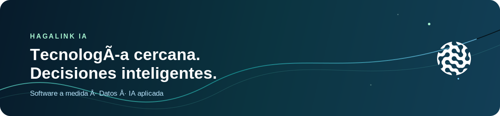

# Ignacio de Loyola Díaz Jiménez

### CEO y cofundador de [Hagalink IA](https://www.hagalink.es)

**Tecnología cercana, humana e inteligente.**

## Sobre mí

Soy emprendedor y CEO de **Hagalink IA**, una consultora tecnológica especializada en software a medida, datos e inteligencia artificial aplicada.

Trabajo con pymes, administraciones, proyectos territoriales y startups que necesitan convertir un reto de negocio en una solución tecnológica **viable, mantenible y útil**.

Mi criterio es sencillo: **diagnosticar antes de programar**. La tecnología debe reducir fricción, mejorar decisiones o abrir oportunidades medibles; si no lo hace, probablemente no sea la solución adecuada.

## En qué estoy trabajando

- **Dirección y estrategia:** convertir problemas reales en oportunidades sostenibles.
- **IA aplicada y datos:** automatización útil, mejores decisiones y procesos más eficientes.
- **Software a medida:** producto digital, integraciones y arquitectura pensada para durar.
- **Innovación territorial:** tecnología cercana para pymes, entornos rurales y sector público.
- **Empresa y equipo:** construir relaciones de largo plazo con clientes y colaboradores.

## Cómo entiendo la tecnología

> La buena tecnología no empieza con una herramienta. Empieza entendiendo qué problema merece la pena resolver.

En Hagalink combinamos visión de negocio, arquitectura sólida, diseño usable y ejecución limpia. Preferimos una solución sencilla que el equipo adopte a una promesa brillante que nadie pueda mantener.

## Áreas de experiencia

  
  
  
  
  

## Hablemos

Si estás intentando mejorar un proceso, validar una idea o aplicar tecnología sin embarcarte en un proyecto infinito, estaré encantado de conocer el contexto.

**[Conecta conmigo en LinkedIn →](https://www.linkedin.com/in/ignacio-de-loyola-d%C3%ADaz-jim%C3%A9nez/)**

*Construir mejor. Decidir con criterio. Crecer con sentido.*

